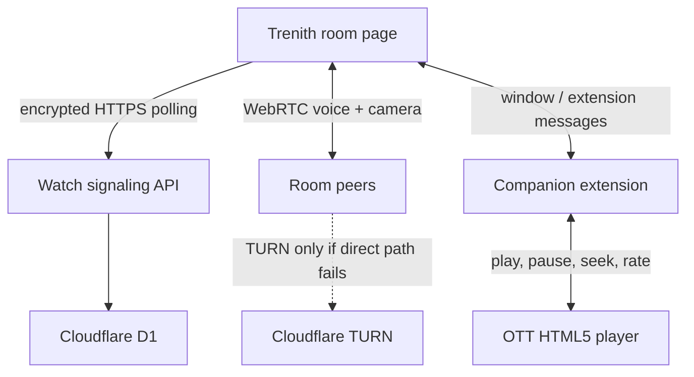

# Trenith Watch Together — complete architecture and release plan

Status: implemented beta architecture · 18 July 2026  
Owner: Trenith Technologies Private Limited  
Scope: synchronized authorized OTT web playback, encrypted chat/reactions, live microphone and camera

## Product contract

Trenith Watch Together coordinates playback state; it never downloads, proxies, decrypts, screen-captures or retransmits the OTT title. Each participant opens the title through their own authorized account, catalog region and provider profile. Provider trademarks identify compatibility only and do not imply affiliation.

The feature targets modern desktop browsers. Native mobile, smart-TV and provider applications cannot be controlled by a website extension and are out of scope for the beta. “All OTTs” is implemented as a provider-adapter system with an honest generic HTML5 fallback—not an unsupported universal promise.

## User flow

1. The host opens `/watch-together`, enters a temporary display name, chooses a provider and selects host-only or everyone controls.
2. The browser creates separate random room-encryption and invitation-proof secrets.
3. The room API stores only the proof hash, opaque participant-token hash, provider, role and expiry. The plaintext invitation proof and encryption secret stay in the URL fragment/session storage.
4. The host installs/opens the companion, switches to the OTT tab and grants optional access only to that origin.
5. Friends open the invitation, enter display names, and open the same title with their own provider accounts.
6. The extension selects the largest visible HTML5 video/audio element, observes local play/pause/seek/rate events and applies authorized remote events.
7. Chat, reactions, playback state and WebRTC negotiation are AES-GCM encrypted in the browser and kept as short-lived signaling events.
8. Camera and microphone remain off until each participant enables them. WebRTC creates a peer mesh for up to six media participants. Rooms above six remain sync/chat capable up to 25 participants.
9. Participants can leave independently. The host ends the room for everyone. Rooms expire after six hours and events after ten minutes.

## Runtime topology

The Sites deployment handles `/api/watch/*` before the Vinext application and binds D1 as `DB`. Vercel uses the same UI and proxies `/api/watch/*` to the configured Sites/Cloudflare origin through `WATCH_SIGNAL_ORIGIN`. This prevents a second room database and keeps invitation membership consistent across `tools.trenith.com` and `tools.trenith.in`.

## Protocol

Protocol version: `1`.

| Message | Purpose | Server-readable content |
| --- | --- | --- |
| `chat` | Temporary room message | Sender, target and timestamps; message body encrypted |
| `reaction` | Emoji reaction | Sender and timestamps; emoji encrypted |
| `playback` | Play, pause, seek, snapshot and rate | Sender and timestamps; player state encrypted |
| `content-change` | Detect different titles/tabs | Sender and timestamps; title/key/deep link encrypted |
| `peer-offer`, `peer-answer`, `peer-ice` | WebRTC negotiation | Sender/target/timestamps; SDP/ICE encrypted |
| `media-state` | Participant microphone/camera UI | Sender/timestamps; state encrypted |
| `room-ended` | Host termination | Sender/timestamps; event body encrypted |

Payloads are capped at 64 KiB. The client polls after the last monotonic sequence number, ignores messages it cannot decrypt, de-duplicates chat IDs and uses bounded exponential recovery after network failure.

## Room API

| Route | Method | Authorization | Result |
| --- | --- | --- | --- |
| `/api/watch/health` | GET | none | Protocol and server time |
| `/api/watch/rooms` | POST | invitation proof in body | Creates host session |
| `/api/watch/rooms/:id` | POST | invitation proof in body | Creates guest session |
| `/api/watch/rooms/:id/events` | GET | bearer participant token | Events after sequence and active roster |
| `/api/watch/rooms/:id/events` | POST | bearer participant token | Adds one opaque encrypted event |
| `/api/watch/rooms/:id/ice` | GET | bearer participant token | STUN and optional short-lived TURN configuration |
| `/api/watch/rooms/:id/leave` | POST | bearer participant token | Deactivates participant |
| `/api/watch/rooms/:id` | DELETE | host bearer token | Ends room and deactivates roster |

Bearer tokens and invitation proofs are hashed with SHA-256 before D1 storage. Active presence uses a 45-second visible window; participants inactive for 90 seconds are deactivated. Expired rows are cleaned during room requests. Production should also run a scheduled cleanup when the room volume makes request-time cleanup inefficient.

## Data model

`watch_rooms`: room ID, proof hash, host participant ID, provider, control mode, creation/expiry/end timestamps.  
`watch_participants`: opaque participant ID, room ID, token hash, display name, role, join/seen timestamps and active state.  
`watch_events`: monotonic sequence, room/sender/optional target, opaque ciphertext, created/expiry timestamps.

No OTT credentials, cookies, stream URLs, movie bytes, room encryption keys or plaintext chat messages belong in this data model.

## Extension architecture

The companion is built with WXT as Manifest V3 for Chrome, Edge and Firefox.

- Required permissions: `activeTab`, `scripting`, `storage`.
- Optional origins: `https://*/*`; the browser prompts only after the user clicks Connect on the current OTT tab.
- The Trenith bridge content script runs only on the two production domains, the Vercel deployment, the Sites deployment and local development.
- The player adapter is a bundled unlisted script injected only after permission is granted.
- No `tabs`, `webRequest`, cookie, history, download or `<all_urls>` required permission.
- No remote code or remotely imported executable JavaScript.
- No screen/tab capture. DRM remains entirely inside the provider player.
- Firefox declares browsing activity, website activity and website content transmission because player URL/title/timing signals leave the add-on for the user-selected Trenith room.

The adapter searches document and open shadow roots for visible `video`/`audio` elements, ranks by visible area, listens for player events, identifies ads conservatively and prevents feedback loops while applying remote state. Provider-specific hostname mapping exists for launch and beta services; the control surface remains HTML5-based so adapters are small and auditable.

## Playback synchronization

- Play and pause are event-driven.
- Seek is applied only when drift exceeds 750 ms.
- Playback rate is bounded to 0.25–4.0.
- A remote-application guard suppresses echo events for 1.4 seconds.
- Advertisement detection pauses sync instead of forcing a seek through ads.
- A content key based on the canonical URL/origin path detects different titles before commands are applied.
- Browser autoplay errors are surfaced and instruct the participant to click play once in the OTT tab.
- A three-second status snapshot repairs missed events and tab/player changes.

Provider websites change without notice. Automated builds prove the adapter is packaged and policy-compliant; release qualification must also execute the manual provider matrix against test accounts that Trenith is authorized to use.

## Audio/video calls

The beta uses a WebRTC full mesh because it keeps media peer-to-peer and avoids paid media-server infrastructure for small rooms. Deterministic offer ordering plus polite/impolite collision handling prevents duplicate-offer deadlocks. Tracks are negotiated when users turn them on. The room fetches ICE configuration only after bearer authorization.

- Default: Cloudflare public STUN.
- Optional recovery: short-lived Cloudflare TURN credentials generated server-side from `TURN_KEY_ID` and `TURN_KEY_API_TOKEN`.
- Media participant cap: 6.
- Sync/chat participant cap: 25.
- No recording, transcription, background effects or server media processing in beta.

For more than six cameras, simulcast, moderation or recording, migrate media to an SFU. Keep the current encrypted signaling API and replace only the peer-mesh media layer.

## Abuse, privacy and safety

- Minimum age: 18.
- No account reduces stored identity but means invitation possession is the primary access factor.
- Share links privately; anyone with the complete link can join until capacity/expiry.
- Camera and microphone are off by default and controlled per participant.
- The server cannot inspect end-to-end encrypted chat for moderation. The beta relies on invite-only rooms, short TTLs, host termination, capacity limits and API rate controls. Before broad public promotion, add per-IP/room creation throttles and abuse-report metadata that does not require plaintext chat access.
- WebRTC peers can expose network addresses to other peers. TURN availability improves connectivity; relay-only mode should be an optional privacy setting once TURN capacity is funded.
- Legal disclosures explicitly cover playback activity, extension permission, encrypted room data and WebRTC media.

## Failure and recovery states

| Failure | Behavior |
| --- | --- |
| Missing/incomplete fragment | Refuse join and ask for a fresh invitation |
| Invalid proof | HTTP 403; no participant created |
| Expired/ended room | HTTP 410 on join; UI marks room ended |
| Missing bearer token | HTTP 401 |
| Host API unavailable | UI enters recovering state with bounded backoff |
| OTT tab missing | Extension reports disconnected; room continues chat/media |
| No HTML5 media | Explicit unsupported-player message |
| Different title | Remote command rejected by content-key mismatch |
| Advertisement | Synchronization temporarily paused for that participant |
| Autoplay blocked | Explicit one-time manual-play instruction |
| Direct WebRTC blocked | TURN used when configured; otherwise camera/voice may fail while sync/chat remains |
| More than 6 people | Camera/voice controls disabled; sync/chat continues to 25 |

## CI/CD

GitHub Actions runs on pushes and pull requests:

1. Node 24 clean install.
2. ESLint for application, Worker and extension source.
3. Sites/Vinext production build and artifact validation.
4. Chrome MV3 and Firefox MV3 extension production builds.
5. Node test suite, including all 48 tool pages, PDF/ZIP/file engines, private-network controls, Watch protocol limits, real D1 room create/join/auth/event/end flows, provider mapping and manifest/package audits.
6. Native Next/Vercel build with `.next` output.
7. Deployment is permitted only after all gates pass.

Release artifacts are generated with `npm run zip:extension`. Store publishing requires separate Chrome Web Store and Mozilla AMO credentials; publishing is intentionally not performed by the web deployment. Store review notes must describe optional site permissions, player data transmission and the absence of screen capture/remote code.

## Required deployment configuration

1. Sites project: D1 binding named `DB` (declared in `.openai/hosting.json`). Apply `drizzle/0000_smiling_lucky_pierre.sql` if the platform does not apply generated migrations automatically.
2. Global/India Vercel projects: `WATCH_SIGNAL_ORIGIN` set to the public Cloudflare/Sites deployment that owns D1.
3. Recommended: create a scoped Cloudflare Realtime TURN key and set `TURN_KEY_ID` plus `TURN_KEY_API_TOKEN` only in the Sites runtime.
4. Connect `tools.trenith.com` and `tools.trenith.in`, then verify bridge matches in the signed extension.
5. Create Chrome Web Store and AMO listings with privacy policy URL `https://tools.trenith.com/privacy` and support URL `https://tools.trenith.com/watch-together/supported`.

## Provider verification matrix

Every release candidate must record date, browser, provider region, title type, player discovered, play, pause, seek, rate, ad transition, episode transition, reconnect and two-participant sync result. Launch status requires all critical columns to pass on at least Chrome and Edge; Firefox remains beta until its own rows pass. A failing provider is downgraded publicly instead of hidden behind a generic “all OTTs” claim.

## Rollout

- Phase 0 — internal: D1, encrypted two-user room, extension unpacked, synthetic HTML5 fixture.
- Phase 1 — invite beta: YouTube, Netflix, Prime Video and JioHotstar desktop web; 6 media/25 sync cap; TURN enabled.
- Phase 2 — public beta: signed Chrome/Edge/Firefox listings, provider status telemetry with consent, abuse throttling and incident runbook.
- Phase 3 — reliability: WebSocket/Durable Object signaling, host transfer, relay-only privacy option, richer provider adapters.
- Phase 4 — scale: SFU for larger media rooms, moderation controls and native companion feasibility research. No native-app claim before platform partnerships or supported deep-link/control APIs exist.

## Success metrics

Measure only with consent and never include OTT title names, invitation secrets, room payloads, chat, microphone/camera content or provider credentials.

- Room creation success and join success.
- Extension detected and player connected rate by adapter version (provider category only when consent/legal basis permits).
- Playback command apply/failure class and recovery time.
- WebRTC connection success, direct-versus-relay aggregate and call setup time.
- Watch-room completion, Trenith service CTA conversion and support rate.
- Provider regression rate and time to downgrade/fix.
